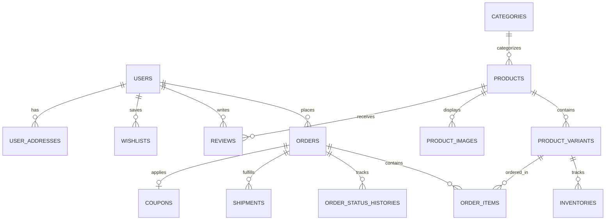

# 🏛️ Kino E-Commerce Backend

A modern, robust, and scalable headless e-commerce backend built with **Laravel 12** and **Filament v5 Admin Panel**, designed for luxury furniture, interior design, and bespoke crafts.

---

## 📋 Table of Contents

- [Features](#-features)
- [Tech Stack](#-tech-stack)
- [Requirements](#-requirements)
- [Installation & Setup](#-installation--setup)
- [Default Seeded Credentials](#-default-seeded-credentials)
- [Filament Admin Panel](#-filament-admin-panel)
- [API Reference](#-api-reference)
  - [Authentication](#authentication)
  - [Products & Categories](#products--categories)
  - [Cart Management](#cart-management)
  - [Checkout & Payments](#checkout--payments)
  - [Orders & Tracking](#orders--tracking)
  - [Wishlist & Reviews](#wishlist--reviews)
  - [Content & Settings](#content--settings)
- [Database Schema & Architecture](#-database-schema--architecture)
- [Development & Artisan Commands](#-development--artisan-commands)

---

## ✨ Features

- 🔐 **Authentication & Authorization**: Laravel Sanctum token-based authentication and Spatie Role-Based Access Control (Admin, Vendor, Customer).
- 🎛️ **Filament v5 Admin Panel**: Full-featured administrative dashboard for managing products, variants, orders, reviews, content sections, coupons, FAQs, blog posts, and site settings.
- 🛍️ **E-Commerce Catalog**: Support for product variants, dynamic attributes, inventory logs, related products, and hierarchical categories.
- 🛒 **Hybrid Cart**: Guest local storage sync with server-side database cart upon login (`/api/cart/merge`).
- 💳 **Stripe Payment Integration**: Payment intent generation, webhook handling, and order confirmation flows.
- 📦 **Order Lifecycle & Tracking**: Shipment management, status history, coupon discounts, and tracking by order number.
- 🎨 **CMS & Dynamic Sections**: Dynamic page sections, blog posts, FAQ management, and global store settings.

---

## 🛠️ Tech Stack

- **Framework**: [Laravel 12](https://laravel.com)
- **Admin Panel**: [Filament v5](https://filamentphp.com)
- **Authentication**: Laravel Sanctum
- **Permissions**: Spatie Laravel Permission
- **Media Handling**: Spatie Laravel MediaLibrary
- **Slugs**: Spatie Laravel Sluggable
- **Payments**: Stripe PHP SDK
- **PDF Generation**: DomPDF (`barryvdh/laravel-dompdf`)
- **Database**: MySQL / PostgreSQL / SQLite

---

## ⚙️ Requirements

- **PHP**: `^8.2` (Extensions: `bcmath`, `ctype`, `fileinfo`, `json`, `mbstring`, `openssl`, `pdo`, `tokenizer`, `xml`, `gd` or `imagick`)
- **Composer**: `^2.0`
- **Node.js & NPM**: `>= 18.x`
- **Database Server**: MySQL 8+ / PostgreSQL 14+ / SQLite 3+

---

## 🚀 Installation & Setup

### 1. Clone & Navigate to Backend
```bash
cd backend
```

### 2. Install PHP & Node Dependencies
```bash
composer install
npm install
```

### 3. Environment Configuration
Copy the `.env.example` file and generate the application key:
```bash
cp .env.example .env
php artisan key:generate
```

Configure your database connection and Stripe keys in `.env`:
```env
APP_NAME="Kino Studio"
APP_URL=http://localhost:8000
FRONTEND_URL=http://localhost:5173

DB_CONNECTION=mysql
DB_HOST=127.0.0.1
DB_PORT=3306
DB_DATABASE=kino_db
DB_USERNAME=root
DB_PASSWORD=

STRIPE_KEY=pk_test_...
STRIPE_SECRET=sk_test_...
STRIPE_WEBHOOK_SECRET=whsec_...
```

### 4. Run Migrations & Seeders
Run database migrations and populate seed data (roles, demo products, categories, pages, demo orders, and admin users):
```bash
php artisan migrate --seed
```

### 5. Link Storage Directory
Symlink the public storage folder for uploaded assets and images:
```bash
php artisan storage:link
```

### 6. Start the Local Server
```bash
php artisan serve
```
The API server will run at: `http://localhost:8000`

---

## 🔑 Default Seeded Credentials

When running `php artisan db:seed`, the following accounts are initialized:

| Role | Email | Password | Permissions |
| :--- | :--- | :--- | :--- |
| **Admin** | `admin@kino.design` | `password` | Full System Access, Filament Admin |
| **Vendor** | `vendor@kino.design` | `password` | Manage Products |
| **Customer** | `julian@sterling.com` | `password` | Storefront & Order History |

---

## 🎛️ Filament Admin Panel

Access the Admin dashboard at:
👉 **`http://localhost:8000/admin`**

### Available Resources
- **Products**: Manage item titles, pricing, variants, tags, descriptions, dimensions, and image galleries.
- **Categories**: Parent and child category taxonomy management.
- **Orders & Shipments**: Manage customer orders, fulfillment state, status transitions, and invoices.
- **Coupons**: Percentage and fixed discount codes with validity rules and minimum spend constraints.
- **Page Sections**: Dynamic landing page hero sections, promos, and banners.
- **Posts (Blog)**: Articles, editorial pieces, and design stories.
- **FAQs**: Categorized help center and FAQ questions/answers.
- **Reviews**: Customer reviews and moderation approval.
- **Contact Messages**: Inquiries submitted through storefront contact forms.
- **Settings**: Global shop configurations, social links, and contact information.

---

## 📡 API Reference

Base URL: `http://localhost:8000/api`

### Authentication
| Method | Endpoint | Description | Auth Required |
| :--- | :--- | :--- | :--- |
| `POST` | `/auth/register` | Register a new user account | ❌ No |
| `POST` | `/auth/login` | Log in and receive Sanctum bearer token | ❌ No |
| `POST` | `/auth/logout` | Revoke current user session token | 🔒 Yes (`auth:sanctum`) |
| `GET` | `/auth/me` | Fetch authenticated user data & addresses | 🔒 Yes (`auth:sanctum`) |
| `POST` | `/profile/update` | Update user profile and address details | 🔒 Yes (`auth:sanctum`) |

---

### Products & Categories
| Method | Endpoint | Description | Auth Required |
| :--- | :--- | :--- | :--- |
| `GET` | `/products` | List paginated products (filters: category, search, sort, price) | ❌ No |
| `GET` | `/products/{slug}` | Get product details with variants, attributes & reviews | ❌ No |
| `GET` | `/products/{id}/related` | Fetch related/recommended products | ❌ No |
| `GET` | `/categories` | List all product categories | ❌ No |

---

### Cart Management
| Method | Endpoint | Description | Auth Required |
| :--- | :--- | :--- | :--- |
| `GET` | `/cart` | Fetch user's persistent cart items | 🔒 Yes (`auth:sanctum`) |
| `POST` | `/cart/update` | Add, update quantity, or remove cart items | 🔒 Yes (`auth:sanctum`) |
| `POST` | `/cart/merge` | Merge guest local storage cart into user cart | 🔒 Yes (`auth:sanctum`) |

---

### Checkout & Payments
| Method | Endpoint | Description | Auth Required |
| :--- | :--- | :--- | :--- |
| `POST` | `/checkout/validate-coupon` | Validate coupon code & calculate discount | ❌ No |
| `POST` | `/checkout/session` | Create Stripe PaymentIntent session | ❌ No |
| `POST` | `/checkout/confirm` | Confirm completed order & store order records | ❌ No |

---

### Orders & Tracking
| Method | Endpoint | Description | Auth Required |
| :--- | :--- | :--- | :--- |
| `GET` | `/orders` | Get authenticated user's order history | 🔒 Yes (`auth:sanctum`) |
| `GET` | `/orders/track/{order_number}` | Track order status & shipment updates by order code | ❌ No |

---

### Wishlist & Reviews
| Method | Endpoint | Description | Auth Required |
| :--- | :--- | :--- | :--- |
| `GET` | `/wishlist` | Get user's saved wishlist products | 🔒 Yes (`auth:sanctum`) |
| `POST` | `/wishlist/toggle` | Add/remove product from wishlist | 🔒 Yes (`auth:sanctum`) |
| `GET` | `/products/{id}/reviews` | Fetch reviews for a specific product | ❌ No |
| `POST` | `/products/{id}/reviews` | Submit a customer rating and review | 🔒 Yes (`auth:sanctum`) |

---

### Content & Settings
| Method | Endpoint | Description | Auth Required |
| :--- | :--- | :--- | :--- |
| `GET` | `/sections` | List all dynamic CMS page sections | ❌ No |
| `GET` | `/sections/{key}` | Fetch specific section by slug / key | ❌ No |
| `GET` | `/faqs` | List all FAQs | ❌ No |
| `GET` | `/posts` | List blog articles & design journals | ❌ No |
| `GET` | `/posts/{slug}` | View full blog post | ❌ No |
| `POST` | `/contact` | Submit contact / support form message | ❌ No |
| `GET` | `/settings` | Retrieve global site configuration | ❌ No |

---

## 🗄️ Database Schema & Architecture



### Core Eloquent Models
- **`User`**, **`UserProfile`**, **`UserAddress`**: Customer & admin account identities.
- **`Product`**, **`ProductVariant`**, **`ProductAttribute`**, **`ProductImage`**: Multi-variant catalog models.
- **`Inventory`**, **`InventoryLog`**: Real-time stock counts and change records.
- **`Order`**, **`OrderItem`**, **`OrderStatusHistory`**, **`Shipment`**: Complete order and fulfillment handling.
- **`Coupon`**, **`CouponUsage`**: Promo codes, discount computations, and customer usage limits.
- **`PageSection`**, **`Post`**, **`FAQ`**, **`Setting`**: Content Management System models.

---

## 💻 Development & Artisan Commands

```bash
# Run tests
php artisan test

# Clear all caches (config, routes, views)
php artisan optimize:clear

# Re-cache configurations for production
php artisan optimize

# Generate Filament resource
php artisan make:filament-resource ModelName --generate

# Re-run fresh migration with seeds
php artisan migrate:fresh --seed
```

---

## 📄 License
This project is open-source software licensed under the [MIT license](https://opensource.org/licenses/MIT).
